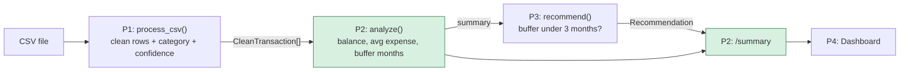

# Person 2 (P2): Prototype Analysis & Implementation Guide

**Project:** Financial Health Copilot
**Phase:** Prototype (the first thin, end-to-end slice)
**Role covered:** P2, Backend Core & Analytics

> **How to read this guide.** Part 1 explains *what* P2 has to build and *why*. Part 2 is the step-by-step build, written so a beginner can follow it. Every step says what we do, why we do it, and how we check it worked. All code referred to here is in the `p2_prototype/` folder and has been run and tested (25 automated tests pass).

---

## Part 1: Analysis of P2's work in the Prototype

### 1.1 What your documents say P2 must deliver

From `02_Team_Work_Division.md`, section 1:

| P2's task | Deliverable | "Good" looks like |
|---|---|---|
| Compute current balance, average monthly expense, and `buffer_months` | `analyze(transactions) → {balance, avg_expense, buffer_months}` | Numbers verified **by hand** against the sample data |
| A minimal backend | `/upload` and `/summary` endpoints | P4's dashboard can call them |
| Integration lead (last 30-45 min) | Wire **P1 → P2 → P3** behind `/upload` | Upload a CSV and see the correct dashboard |

Two more things are implied by the kickoff section (hour 1):
- P2 **creates the repo and folder structure** (`backend/`, `frontend/`, `contracts/`, `sample_data/`).
- P2 and P4 **agree the API endpoint names** together.

### 1.2 Where P2 sits in the flow

P2 is the **middle** of the prototype. P1 feeds P2, P2 feeds P3, and P4 reads the result.



Green boxes are P2's. P2 also owns the wiring that connects P1 and P3.

### 1.3 Why P2 is the most "connected" role

| P2 depends on | P2 is depended on by |
|---|---|
| P1's row shape (`CleanTransaction`) | P3 needs P2's summary to make the recommendation |
| The agreed endpoint names (with P4) | P4 needs P2's endpoints to show real data |

Because everyone depends on P2, two habits matter:
1. **Don't wait for P1 or P3.** Build against a small stand-in for each (we do this in Step 5).
2. **Return mock-shaped data early** so P4 is never blocked.

### 1.4 What is deliberately *not* in P2's prototype

Straight from the "Out of scope" column in Doc 01. Do not build these yet:

- Login, database, Supabase, Render deployment
- PDF parsing, recurring detection, dedup
- Cash-flow forecast, debt analysis
- What-if simulator, chat

Keeping these out is what makes the prototype finishable in a few hours.

### 1.5 How this small piece grows into P2's Final-build job

Nothing you build now is thrown away. It becomes the seed of the bigger tasks:

| Prototype (now) | Becomes (Final build) |
|---|---|
| `analyze()` | `buffer_months()` (task 5) and part of `recompute()` (task 6) |
| `main.py` with in-memory state | Backend skeleton on Render with all endpoints (task 2) |
| `pipeline.py` chaining P1 → P2 → P3 | Integration lead work (task 8) |
| `tests/` | CI unit tests (task 7) |
| `contracts.py` validation | Guard at Seam A (P1 → P2) |

### 1.6 Risks I spotted, and how the prototype handles them

| Risk | What could go wrong | How it's handled |
|---|---|---|
| **No opening balance in the CSV** | "Current balance" is unknown; a plain sum only gives net cash flow | `opening_balance` option (default 0), documented as an assumption (see 3.1) |
| **Months divided wrongly** | Dividing by "months with spending" hides empty months and inflates savings | We divide by calendar months from first to last date |
| **Divide by zero** | A file with only income crashes `balance / avg_expense` | `buffer_months` returns `None`, and the recommendation is skipped |
| **Negative balance** | Would show "negative months" of buffer | Clamped to 0 |
| **Float rounding** | ₹19,294 showed as ₹19,295 during testing | Fixed: use exact average, round the gap to paise before rounding up |
| **Bad CSV from a user** | Server crash or silent wrong numbers | Clear 400 error naming the row/column |
| **P1 changes a field name** | Silent breakage at integration | `validate_transactions()` fails loudly with the row id |
| **Browser blocks P4's calls** | Frontend on port 3000 calling backend on 8000 is blocked | CORS enabled for `localhost:3000` |

---

## Part 2: Step-by-step implementation

### The finished project layout

```text
p2_prototype/
├── backend/
│   ├── __init__.py
│   ├── contracts.py          # shared data shape + confidence labels + validation
│   ├── analytics.py          # ★ P2's core: analyze()
│   ├── pipeline.py           # glue: P1 → P2 → P3
│   ├── main.py               # ★ FastAPI app: /upload, /summary, ...
│   └── stubs/
│       ├── p1_pipeline.py    # temporary stand-in for P1's process_csv()
│       └── p3_recommend.py   # temporary stand-in for P3's recommend()
├── sample_data/
│   └── prototype_sample.csv  # 24 rows, 3 months, hand-checkable
├── tests/
│   ├── test_analytics.py     # unit tests for analyze()
│   └── test_api.py           # end-to-end tests over HTTP
├── docs/
│   └── P2_Prototype_Implementation_Guide.md   # this file
├── requirements.txt
└── README.md
```

---

### Step 0: Set up the project

**What:** Create the folders and install the tools.

**Why:** A clean structure lets teammates find things. It also matches the folder names your Doc 02 asks P2 to create.

```bash
cd p2_prototype
python -m venv .venv
source .venv/bin/activate          # Windows: .venv\Scripts\activate
pip install -r requirements.txt
```

What each package does, in plain words:

| Package | Job |
|---|---|
| `fastapi` | Lets us write web endpoints as ordinary Python functions |
| `uvicorn` | The engine that runs the FastAPI app |
| `python-multipart` | Lets the server accept file uploads |
| `httpx` + `pytest` | For automated tests |

**Check it worked:** `python --version` shows 3.10 or newer.

---

### Step 1: Agree the "shape" of the data (`contracts.py`)

**What:** Write down exactly what one transaction row looks like, and the rules for confidence labels.

**Why:** Four people work in parallel. If P1 calls a field `amt` and P2 expects `amount`, everything breaks at integration. The contract is the promise everyone keeps.

A transaction row (`CleanTransaction`) looks like this. P2 *needs* the first six fields:

```json
{
  "id": "t_001",
  "date": "2026-07-03",
  "amount": 15000.0,
  "direction": "debit",
  "category": "Rent",
  "confidence_score": 0.92,
  "description": "RENT TRANSFER - LANDLORD",
  "flow_type": "real_expense",
  "confidence_label": "Confirmed"
}
```

**Confidence labels** (from Doc 01), turned into one small function:

| Score | Label |
|---|---|
| 0.85 or more | Confirmed |
| 0.60 up to 0.85 | Likely |
| below 0.60 | Uncertain |

**Validation:** `validate_transactions()` checks every incoming row *before* any maths happens. If a row has no `amount`, or a date that isn't `YYYY-MM-DD`, it stops with a message like `Transaction t_007: date must look like YYYY-MM-DD`.

> **Why validate?** Wrong data that *looks* fine is worse than a crash. A crash with a clear message gets fixed in one minute. A silently wrong balance can reach the demo.

**Check it worked:** The parametrized test `test_bad_input_fails_with_clear_message` tries five kinds of bad input.

---

### Step 2: Make sample data and work out the answers by hand FIRST

**What:** Before writing any maths code, build a small CSV and calculate the expected results with pen and paper.

**Why:** If you write the code first, you'll be tempted to trust whatever it prints. Hand-calculated answers are your independent proof. (Doc 02 asks for exactly this: "numbers verified by hand".)

`sample_data/prototype_sample.csv` has 24 rows over Jul-Sep 2026. It includes salary, rent, groceries, Netflix, plus **two deliberately unclear rows** (`UPI-RAHUL K-9876`) so the low-confidence path gets exercised.

**Hand calculation:**

| Month | Salary in | Money out |
|---|---|---|
| Jul | 50,000 | 15,000 + 1,200 + 3,000 + 649 + 800 + 1,800 + 8,000 = **30,449** |
| Aug | 50,000 | 15,000 + 1,500 + 3,500 + 649 + 1,000 + 2,100 + 5,000 = **28,749** |
| Sep | 50,000 | 15,000 + 1,800 + 3,200 + 649 + 900 + 1,900 + 2,000 = **25,449** |
| **Total** | **150,000** | **84,647** |

Now the three numbers:

1. **Balance** = 150,000 − 84,647 = **₹65,353**
2. **Average monthly expense** = 84,647 ÷ 3 months = **₹28,215.67**
3. **Buffer months** = 65,353 ÷ 28,215.67 = **2.32 months**

And the prototype rule (Step 5 of Doc 01, section 2.3):

4. 2.32 is below 3, so a recommendation appears.
5. Money needed = (3 × 28,215.67) − 65,353 = 84,647 − 65,353 = **₹19,294**
6. Saving per month over 6 months = 19,294 ÷ 6 = 3,215.67, rounded up to **₹3,216**

Keep these six numbers. The tests check every one of them.

---

### Step 3: Write `analyze()`, P2's core function (`analytics.py`)

**What:** One function. A list of transactions goes in; a dictionary of numbers comes out.

**Why:** It is a "pure function": no web code, no files, no database. That makes it trivial to test, and it can later be reused inside `recompute()` for the What-If feature without changes.

Here is how each output is computed, in everyday language:

**a) Balance**
```
balance = opening_balance + (all money in) − (all money out)
```
*Like a bank passbook total.* All rows count here, because cash really did leave the account, even for a credit-card bill payment.

**b) Average monthly expense**
```
avg_expense = total real expenses ÷ number of months covered
```
- "Real expenses" = debits that are not `card_bill_payment` or `self_transfer`. (P1's prototype doesn't label these yet, but the Final build will, so the filter is ready.)
- "Months covered" = calendar months from the earliest to the latest date, counting empty ones. Jan and Mar only → 3 months, not 2.

**c) Buffer months**
```
buffer_months = balance ÷ avg_expense
```
This answers: *"If my income stopped today, how many months could I live on what I have?"*

Three safety rules:

| Situation | What we return | Reason |
|---|---|---|
| No spending at all | `None` | Can't divide by zero |
| Balance below zero | `0` | "Minus 2 months" makes no sense to a user |
| Normal case | Rounded to 2 decimals | Clean display |

**d) Extra numbers (allowed: contracts may *add* fields, never rename or remove)**

| Extra field | Who uses it | What it is |
|---|---|---|
| `category_breakdown` | P4's chart | Spending per category, biggest first, with % |
| `data_quality` | P3's confidence | Average confidence of the spending rows, **weighted by amount** |
| `uncertain_rows` | UI hint | How many rows need the user's attention |
| `months_covered`, `total_income`, `total_expense` | Explanations / debugging | The building blocks |

> **Why weight by amount?** One unclear ₹100 row shouldn't drag down the trust in a ₹50,000 rent row. In our sample, `data_quality` is 0.86 (Confirmed), because the two unclear rows total ₹10,000 out of ₹84,647.

**Check it worked:** Run just this file's tests:
```bash
python -m pytest tests/test_analytics.py -v
```

---

### Step 4: Write unit tests for `analyze()`

**What:** Small tests, each with a tiny dataset whose answer is obvious.

**Why:** Tests are the "safety net" that lets you change code later (like adding forecasting) without fear. They also count toward your team's "Definition of done".

What is covered:

| Test | Proves |
|---|---|
| `test_core_numbers` | Balance, average, buffer are right on a simple 2-month case |
| `test_opening_balance_is_added` | The optional starting balance works |
| `test_gap_month_still_counts_in_average` | Empty months are averaged in |
| `test_card_bill_and_self_transfer_are_not_expenses` | Only real spending is averaged |
| `test_negative_balance_gives_zero_buffer` | No negative buffer |
| `test_no_spending_gives_none_not_a_crash` | No divide-by-zero |
| `test_category_breakdown_sorted_with_percentages` | Chart data is right |
| `test_data_quality_is_amount_weighted` | Weighting works |
| `test_bad_input_fails_with_clear_message` | Contract guard works |

---

### Step 5: Build temporary stand-ins for P1 and P3 (`stubs/`)

**What:** Two tiny files that pretend to be P1's `process_csv()` and P3's `recommend()`.

**Why:** P2 is the integration lead, but P1 and P3 aren't finished when you start. Stand-ins let you run and test the *whole* flow today. The signatures and output shapes match Doc 02 exactly, so swapping in the real ones later is a one-line change.

**P1 stand-in (`p1_pipeline.py`):**
1. Reads the CSV with Python's `csv.DictReader`.
2. Checks the four required columns exist (`date`, `description`, `amount`, `type`).
3. Cleans each row: strips commas and ₹ from amounts, accepts `2026-07-03` or `03/07/2026`, accepts `credit/debit` or `CR/DR`.
4. Matches keywords (Swiggy → Food, RENT → Rent, …).
   - Keyword found → confidence **0.92** (Confirmed)
   - Nothing found → `Uncategorized`, confidence **0.40** (Uncertain)
5. Fills every contract field, so P2 can't tell it apart from the real P1.

**P3 stand-in (`p3_recommend.py`):** implements the single prototype rule:
```
if buffer_months < 3:
    monthly_saving = ceil( (3 × avg_expense − balance) ÷ 6 )
```
and returns a full `Recommendation` object (title, explanation, label, confidence, before/after, `requires_user_confirmation: true`). If the buffer is healthy, it returns `None`, and the dashboard shows "nothing to recommend".

**A bug found while testing:** the first version showed a gap of ₹19,295 instead of ₹19,294. Cause: computing `3 × 28215.666…` in floating point gave `84647.00000000001`, and rounding *up* turned that into a whole extra rupee. Fix: use the exact average (`total ÷ months`), round the gap to 2 decimals, *then* round up. This is exactly why we did the hand calculation in Step 2.

> **Remember:** these are stand-ins. They are marked as such in their file headers so nobody mistakes them for the real thing.

---

### Step 6: Connect the pieces (`pipeline.py`)

**What:** One short function that runs the three stages in order.

```python
def run_prototype_pipeline(csv_text, opening_balance=0.0):
    transactions   = process_csv(io.StringIO(csv_text))   # P1
    summary        = analyze(transactions, opening_balance)  # P2
    recommendation = recommend(summary)                   # P3
    return {"transactions": ..., "summary": ..., "recommendation": ...}
```

**Why a separate file?** It is the *only* place that knows which P1 and P3 are being used. At integration, you change two `import` lines here and nothing else.

---

### Step 7: Build the backend endpoints (`main.py`)

**What:** A small FastAPI app that exposes the pipeline over HTTP.

| Endpoint | Method | What it does |
|---|---|---|
| `/health` | GET | Returns `{"status":"ok"}`. Use it to check the server is alive |
| `/upload` | POST | Accepts a CSV file (optional `?opening_balance=`), runs the pipeline, returns summary + recommendation |
| `/summary` | GET | Returns the latest summary + recommendation (P4's dashboard reads this) |
| `/transactions` | GET | Returns every cleaned row with category and confidence |
| `/load-sample` | POST | Loads the built-in sample CSV in one click (great for demos) |

**How it stores data:** in one Python dictionary (`STATE`). No database. Restarting the server clears it. Doc 01 says exactly this for the prototype ("in-memory or a JSON file").

**Protections built into `/upload`:**

| Check | Response |
|---|---|
| File isn't `.csv` | 400: "Only .csv files are supported…" |
| File bigger than 2 MB | 413: "File too large" |
| Not valid text | 400 |
| Missing columns / bad amount / bad date | 400 with the row number, e.g. `Row 1: amount 'abc' is not a number` |
| `/summary` before any upload | 404: "No data yet. POST a CSV to /upload first." |

**Two small but important details:**
- `utf-8-sig` decoding: Excel adds an invisible marker (BOM) to CSV files, which would otherwise corrupt the first column name (`date`).
- The response of `/upload` is intentionally the **same shape** as `/summary`, so P4 can use one type for both.

---

### Step 8: Allow P4's frontend to call the backend (CORS)

**What:** Three lines in `main.py` that permit `http://localhost:3000`.

**Why:** Browsers block a page on one address (Next.js, port 3000) from calling another (FastAPI, port 8000) unless the server says it's allowed. Without this, P4 sees a confusing "CORS error" and thinks *your* backend is broken.

Verified: a request with `Origin: http://localhost:3000` gets back `access-control-allow-origin: http://localhost:3000`.

---

### Step 9: Run it and test it

**9a) Run all automated tests (25 should pass):**
```bash
python -m pytest -q
```

**9b) Start the server:**
```bash
uvicorn backend.main:app --reload --port 8000
```

**9c) Try it in the browser.** Open <http://localhost:8000/docs>. FastAPI builds a free test page: click `POST /upload` → *Try it out* → choose `sample_data/prototype_sample.csv` → *Execute*.

**9d) Or use the terminal:**
```bash
curl -X POST -F "file=@sample_data/prototype_sample.csv" http://localhost:8000/upload
curl http://localhost:8000/summary
```

**9e) Confirm the numbers match your hand calculation from Step 2:**

| Field | Hand-calculated | Program output |
|---|---|---|
| `balance` | 65,353 | 65353.0 ✅ |
| `avg_expense` | 28,215.67 | 28215.67 ✅ |
| `buffer_months` | 2.32 | 2.32 ✅ |
| `monthly_saving` | 3,216 | 3216 ✅ |
| Rows marked Uncertain | 2 | 2 ✅ |

**9f) See the "healthy" path:** upload with `?opening_balance=40000`. Buffer becomes 3.73 months, and `recommendation` is `null`.

---

### Step 10: Integration day (the last 30-45 minutes)

This is P2's "integration lead" job. Do it one seam at a time.

**10a) Replace P1's stand-in**
1. Get P1's real `process_csv` (in their branch or merged to `main`).
2. In `backend/pipeline.py`, change:
   ```python
   from .stubs.p1_pipeline import process_csv
   ```
   to import from P1's module.
3. Run `python -m pytest -q`. If a test fails, `validate_transactions()` will name the exact row and field P1 got wrong. Show it to P1.

**10b) Replace P3's stand-in**
1. Same idea: change the `recommend` import in `pipeline.py`.
2. Check the output has every key in the Recommendation contract (`test_recommendation_matches_contract_keys` does this).

**10c) Point P4 at the real API**
1. Tell P4 the base URL (`http://localhost:8000`).
2. P4 changes the mock-JSON import to a `fetch` of `/summary`. Doc 02 says this should be a "one-line change".
3. Upload the sample CSV and check the dashboard shows **balance 65,353** and the recommendation card.

**10d) Final milestone from Doc 02:** *upload a CSV and see the correct dashboard.* ✅

---

## Part 3: Design decisions and assumptions (please confirm with the team)

| # | Decision | Why | Who to confirm with |
|---|---|---|---|
| 1 | **Balance = opening balance + credits − debits.** The CSV has no balance column, so opening balance defaults to 0 | Simplest honest option. If your real bank CSV has a "balance" column, use the last value instead | P1 + P4 |
| 2 | **Average uses calendar months from first to last date** | Avoids inflating the average when a month is empty | P2 |
| 3 | **All credits count as income** in the prototype | Refund/self-transfer detection is a Final-build feature | P1 |
| 4 | **Confidence of the recommendation = amount-weighted data quality** (stand-in) | Real weakest-link scoring is P1's library + P3's gate in Final | P1 + P3 |
| 5 | **`recommendation` is `null` when buffer ≥ 3 months** | Nothing to recommend; P4 must handle `null` | P3 + P4 |
| 6 | **Extra fields added to the summary** | Contracts allow adding. Announce it in the group chat | All |

---

## Part 4: Quick troubleshooting

| Symptom | Likely cause | Fix |
|---|---|---|
| `ModuleNotFoundError: backend` | Running from the wrong folder | `cd` into `p2_prototype/` and use `python -m pytest` / `uvicorn backend.main:app` |
| P4 sees a CORS error | Frontend runs on a different port | Add that origin in `main.py` (`allow_origins`) |
| `400 CSV is missing column(s)` | Header names differ | Headers must be `date, description, amount, type` |
| `404 No data yet` | Server restarted (memory cleared) | Upload again or `POST /load-sample` |
| `buffer_months` is `null` | File has no debit rows | Expected; there is nothing to average |
| All rows "Uncategorized" | Descriptions don't contain known keywords | Add keywords in `KEYWORD_RULES` (P1's file) |

---

## Part 5: Prototype "Definition of done" checklist

- [x] `analyze()` returns `balance`, `avg_expense`, `buffer_months` (plus extras)
- [x] Numbers verified by hand against the sample data (Step 2 and 9e)
- [x] `POST /upload` and `GET /summary` work
- [x] P1 → P2 → P3 chained in one place (`pipeline.py`)
- [x] Errors return clear messages instead of crashing
- [x] CORS enabled for P4's Next.js dev server
- [x] 25 automated tests pass
- [ ] Swap in P1's real `process_csv` *(integration day)*
- [ ] Swap in P3's real `recommend` *(integration day)*
- [ ] P4 points the dashboard at `/summary` *(integration day)*
- [ ] Open a PR to `main` (never push directly)

---

## Part 6: What to build next (Final build, P2's list)

Once the prototype milestone is reached, P2's next tasks from Doc 02 are:

1. **Supabase**: auth, tables, row-level security, private storage.
2. **Deploy the skeleton on Render** with all endpoints returning mock data.
3. **`forecast()`**: cash left before next salary, using P1's recurring series.
4. **`analyze_debt()`**: total EMI, debt-to-income.
5. **`recompute()`**: chain everything in one function so P3's What-If can reuse it.
6. **CI**: GitHub Actions running the tests you already have.

Good news: the tests, the endpoint structure, the contract validation, and `analyze()` all carry straight over.

---
**Note (integration update):** this guide describes P2's original standalone
prototype (P1 and P3 as stubs, single `/upload` + `/summary` endpoints).
P2's core (`analyze()`, its contracts, its category-breakdown math) is
unchanged and still exactly what's described below. What sits around it has
since changed - see `P1_P4_Integration_Notes.md` for the full, current
picture: real P1, real P3 engine, real P4 dashboard, and the extra
endpoints that connect them.
